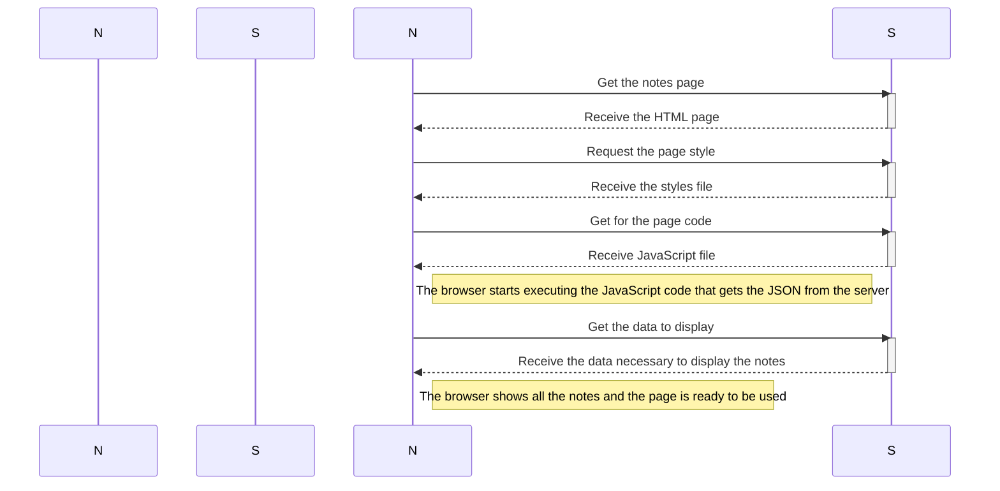

```mermaid

sequenceDiagram
    participant BROWSER as N
    participant SERVER as S

    N->>S: Get the notes page
    activate S
    S-->>N: Receive the HTML page
    deactivate S

    N->>S: Request the page style
    activate S
    S-->>N: Receive the styles file
    deactivate S

    N->>S: Get for the page code
    activate S
    S-->>N: Receive JavaScript file
    deactivate S

    Note right of N:  The browser starts executing the JavaScript code that gets the JSON from the server

    N->>S: Get the data to display
    activate S
    S-->>N: Receive the data necessary to display the notes
    deactivate S

    Note right of N: The browser shows all the notes and the page is ready to be used

```